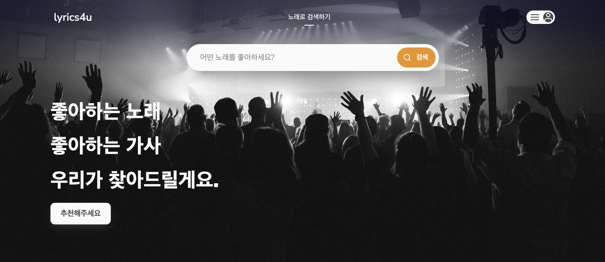

# lyrics4u

## 서비스 배포 (한글 가사만 지원)

## 서비스 예상도

## 시연 영상

## 프로젝트 주제

가사 유사도와 감정예측을 기반으로 한 노래 추천

## 주제 선정의 배경 및 이유

노래의 여러 요소 중 ‘가사’는 사람들에게 중요한 의미를 가진다. 가사를 통해 위로나 용기를 얻고 싶어하고, 현재 가지고 있는 감정을 극대화 하고 싶어하기도 한다. 실제 미국 사우스플로리다 대학 연구진의 연구에 따르면, 우울증 환자들을 대상으로 슬픈 음악, 즐거운 음악, 영화 OST를 들려 준 후 선호도를 조사 하였더니 슬픈 음악을 제일 많이 선택하였다. 이는 ‘자신의 감정 상태를 이해하고 공감을 얻을 수 있는 노래를 택하였다’고 해석할 수 있다. 이에, 우리는 AI 6기 과정동안 배운 지식을 활용하여 가사기반으로 유사도를 확인하고 감정을 분류하여 사람들에게 의미있는 노래를 추천해주고자 한다.

## 데이터

- [멜론 크롤링](https://www.melon.com/)

- [KOTE Dataset](https://github.com/searle-j/kote)

## 모델링

- 가사 감정 분류 모델 : 댓글 감정 분류 데이터셋을 전처리하여 전이학습에 활용 /  학습된 모델로 노래 가사의 감정 분류에 사용
- 가사 유사성 기반 모델 : 사전학습모델을 불러와서 단어 임베딩 벡터를 뽑아 벡터간의 코사인 유사도 비교.

## 결과

- 가사의 유사성을 기반으로 학습시킨 모델이 정서, 장르 등의 특성을 분류, 예측.
- 텍스트를 기반으로 음악을 분류하기 때문에, 텍스트 형태의 다른 데이터(예: 뉴스, 기사, 책)나 텍스트로 변환될 수 있는 다른 종류의 데이터(예: 이미지) 또한 모델 입력으로 활용될 수 있다.
- 기존의 음성 기반 음악 추천 시스템과 달리, 가사의 의미가 분류에 직접적으로 활용될 수 있으므로 사용자에게 보다 만족감을 주는 음악 추천 기능을 제공할 수 있을 것으로 기대한다.

## 우리 팀을 소개합니다.
 
|  이주승  |  양조은  |  윤재은  |  이지홍  |  한성민  |
|--------|--------|--------|--------|--------|
| </img> | </img> | </img> | </img> | </img> |
|  |  |  |  |  |

## 출처

[GitHub - freejin23/lyrics4u](https://github.com/freejin23/lyrics4u)

## 참고자료

[Blog · ratsgo's blog](https://ratsgo.github.io/blog/)

[GitHub - searle-j/KOTE: Korean Online That-gul Emotions Dataset](https://github.com/searle-j/KOTE)
